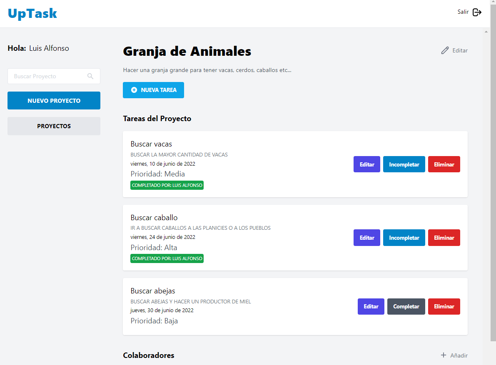
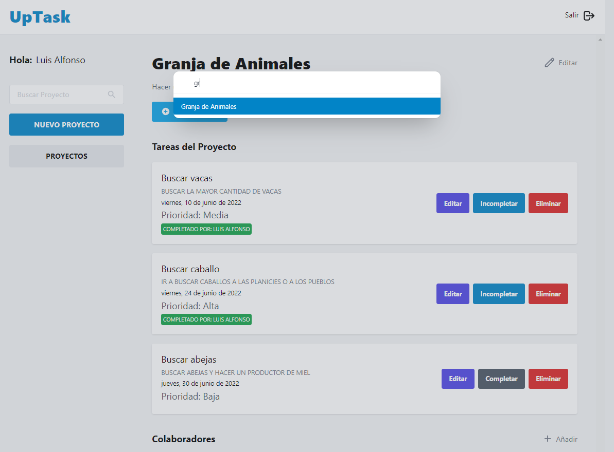
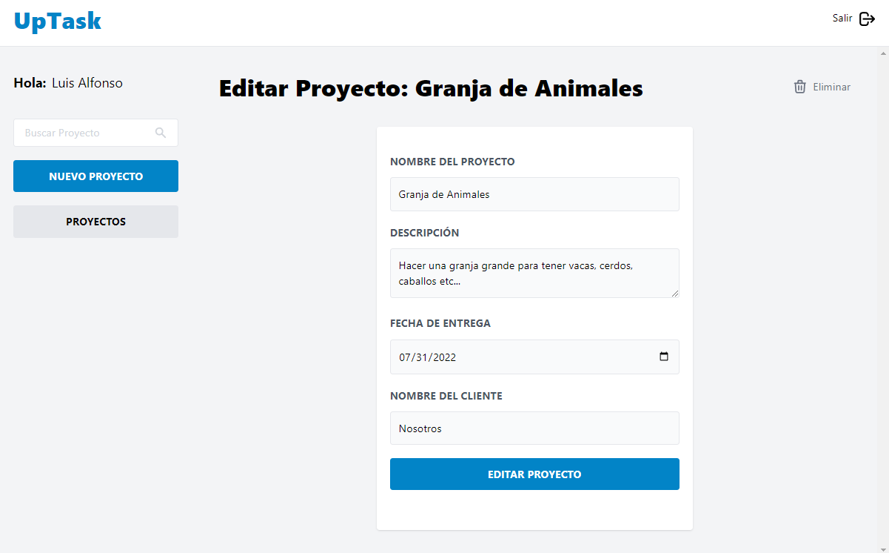
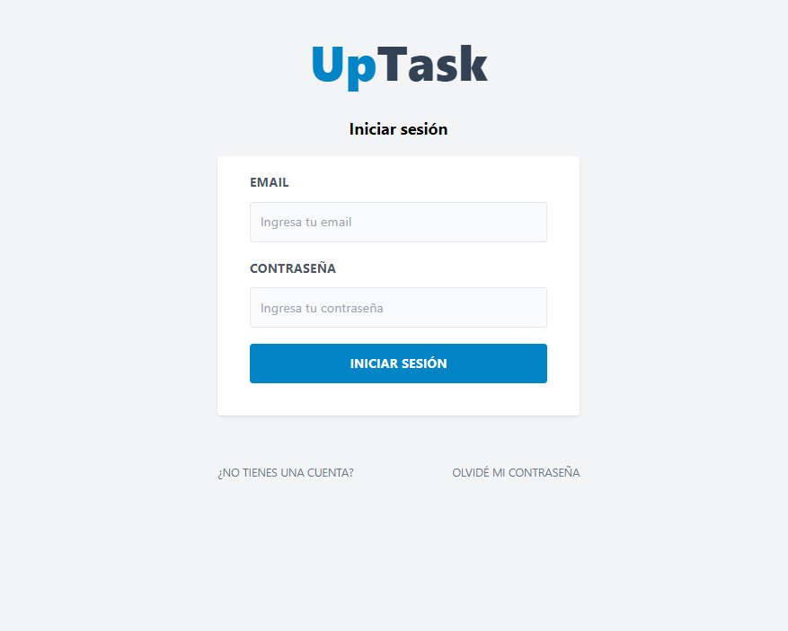
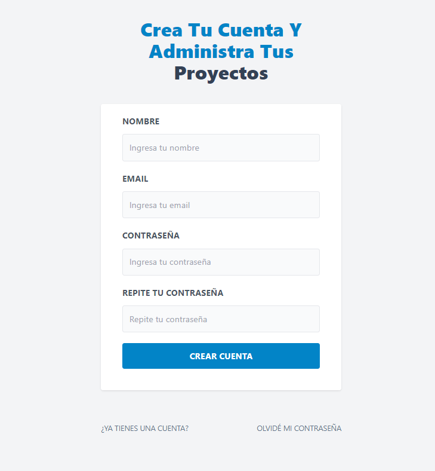
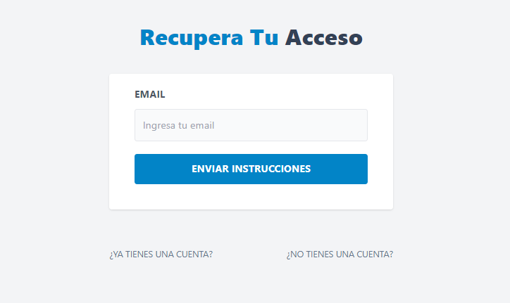

# Uptask frontend

This project is made with Vite, Tailwind CSS and Socket.io

## Demo

You can log in with `guest@mail.com` and `abc123`

[https://uptask-frontend-eme-hache.vercel.app/](https://uptask-frontend-eme-hache.vercel.app/)

## Environment Variables

To run this project, you will need to add the following environment variables to your .env file

`VITE_BACKEND_URL`

## Local Development

To use this project locally, you'll need to set up a local develop environment with `Uptask backend`. Follow these steps:

1. Clone `Uptask backend`:

   ```bash
   git clone https://github.com/eme-hache/uptask-backend
   ```
2. See the instructions to run the server on the `Uptask backend` repo
3. Once backend is running, use `dev` command to run frontend

## Screenshot

<div align="center">
  
  
  
  
  
  
  
  
</div>
